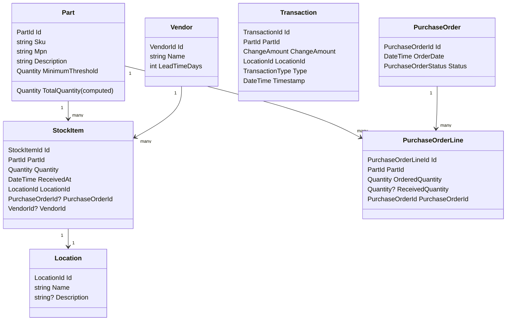

# Pulse Domain Model Documentation

## Class Diagram

---

## Entity Descriptions

Ha, nicely spotted, Ales — you got me there! Let’s bring the documentation back in sync with the codebase. I’ve updated the **Mermaid class diagram** to include `LeadTimeDays` on `Vendor`, and I’ve regenerated the **entity descriptions** accordingly.

---

## 📊 Updated Class Diagram

---

## 📖 Entity Descriptions

- **Part**  
  Represents a catalogued item in the system. Defines SKU, manufacturer part number, description, and minimum threshold. Aggregates stock items and provides a computed `TotalQuantity`.

- **StockItem**  
  An inventory record: “We have X units of Part Y at Location Z.”  
  References a `Part`, a `Location`, and optionally the `PurchaseOrder` and `Vendor` it originated from.

- **Location**  
  A physical or logical place where stock is stored (e.g., warehouse, shelf, bin). Independent entity with its own lifecycle.

- **PurchaseOrder**  
  Represents an order placed with a vendor. Contains metadata like order date and a `Status` (a value object) that enforces valid workflow transitions.

- **PurchaseOrderLine**  
  A line item within a purchase order: “We ordered N units of Part P.”  
  Tracks both ordered and received quantities.

- **Transaction**  
  A record of stock movement: “On this date, this part changed by this amount at this location.”  
  Uses a strongly typed `TransactionType` enum to classify the movement (Receipt, Consumption, Adjustment, Transfer).  
  Provides auditability and traceability.

- **Vendor**  
  Represents a supplier from whom parts are procured.  
  Properties include `Name` and `LeadTimeDays` (the expected delivery lead time in days).  
  Independent entity with its own identity.

---

## Domain Events

Perfect — let’s bring the **Domain Events** section of your documentation up to date with the recent refinements (`PurchaseOrderStatus` as a value object with transitions, and `TransactionType` as an enum). This way, your docs remain a faithful reflection of the codebase.

---

## 📢 Domain Events

Domain events capture meaningful business occurrences in the Pulse system. They are raised by entities or services to signal that something important has happened in the domain. These events are consumed by the application layer or external systems to trigger side effects (notifications, workflows, integrations).

---

### Current Events

- **StockItemReceived**  
  Indicates that stock has been received into inventory (e.g., from a purchase order).  
  **Payload**: `PartId`, `Quantity`, `LocationId`, `PurchaseOrderId?`, `VendorId?`.

- **StockItemDepleted**  
  Indicates that stock has been consumed or removed.  
  **Payload**: `PartId`, `Quantity`, `LocationId`.

- **PurchaseOrderCreated**  
  Signals that a new purchase order has been placed.  
  **Payload**: `PurchaseOrderId`, `VendorId`, `OrderDate`.

- **PurchaseOrderLineReceived**  
  Indicates that a line item on a purchase order has been partially or fully received.  
  **Payload**: `PurchaseOrderLineId`, `ReceivedQuantity`.

- **ThresholdBreached**  
  Indicates that a part’s total stock has fallen below its minimum threshold.  
  **Payload**: `PartId`, `CurrentQuantity`, `Threshold`.

---

### Considerations

- **PurchaseOrderStatus transitions**  
  With `PurchaseOrderStatus` now a value object, transitions between states are explicit and validated. This opens the door to raising **status transition events** in the future, for example:
  - `PurchaseOrderSubmitted` (when moving from Draft → Submitted)  
  - `PurchaseOrderApproved` (when moving from Submitted → Approved)  
  - `PurchaseOrderReceived` (when moving from Approved → Received)  
  - `PurchaseOrderCancelled` (when moving to Cancelled)

  These events would allow the application layer to react to workflow milestones (e.g., notify procurement, trigger invoicing, update dashboards).

- **TransactionType as enum**  
  Since `Transaction.Type` is now strongly typed, events like `StockItemReceived` or `StockItemDepleted` can be enriched with a `TransactionType` value. This ensures downstream consumers know exactly what kind of movement occurred, without relying on string parsing.

---

### 📌 Guidelines for Future Events

1. **Raise events at meaningful domain milestones** (not for every property change).  
2. **Keep payloads minimal but sufficient** — include identifiers and values needed by consumers, not entire aggregates.  
3. **Name events in the past tense** (e.g., `PurchaseOrderApproved`) to reflect that something has already happened.  
4. **Leverage strong types** (`PurchaseOrderStatus`, `TransactionType`, `Quantity`) in event payloads to avoid ambiguity.  
5. **Document new events** in this section whenever the domain model evolves.

---

## InventoryService

The `InventoryService` is an application service that orchestrates domain operations. It should be used by the application layer (e.g., APIs, UI) to interact with the domain.

### Methods

- **ReceiveStock(PartId partId, Quantity quantity, LocationId locationId, PurchaseOrderId? poId, VendorId? vendorId)**  
  Creates a new `StockItem`, raises `StockItemReceived`, and records a `Transaction`.

- **ConsumeStock(PartId partId, Quantity quantity, LocationId locationId)**  
  Depletes stock, raises `StockItemDepleted`, and records a `Transaction`.  
  If depletion causes stock to fall below threshold, raises `ThresholdBreached`.

- **CreatePurchaseOrder(VendorId vendorId, DateTime orderDate, IEnumerable<(PartId, Quantity)> lines)**  
  Creates a new `PurchaseOrder` with lines, raises `PurchaseOrderCreated`.

- **ReceivePurchaseOrderLine(PurchaseOrderLineId lineId, Quantity receivedQuantity)**  
  Updates a purchase order line, raises `PurchaseOrderLineReceived`, and creates corresponding `StockItem`s.

---

## Usage Notes
- The domain model enforces invariants (e.g., you cannot receive negative quantities).  
- The service coordinates multiple entities and raises domain events.  
- The application layer subscribes to domain events to trigger side effects (e.g., notifications, reordering).
