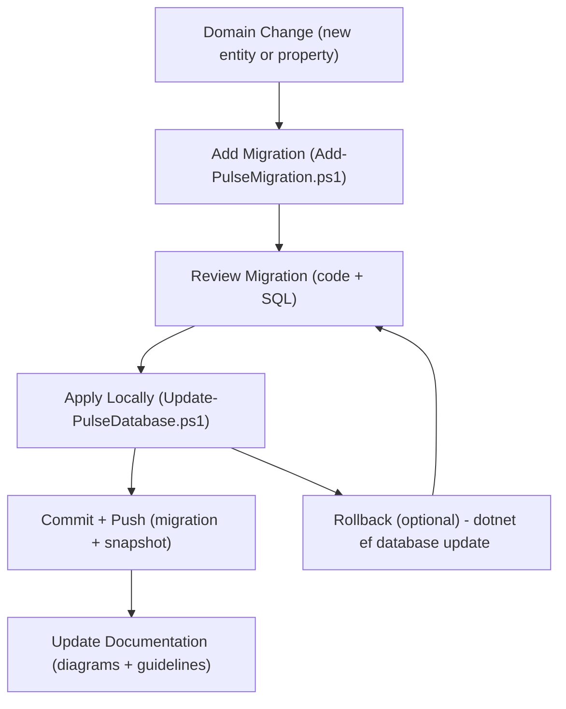

# EF Core Migration Scripts (Pulse)

This folder contains helper scripts for managing **Entity Framework Core migrations** in the Pulse application.  
They standardize naming, commands, and workflow so migrations are consistent across the team.

---

## 📂 Scripts

### `Add-PulseMigration.ps1`

Creates a new migration with a **timestamped name**.

```powershell
.\tools\ef\Add-PulseMigration.ps1 -Name "AddVendorToPurchaseOrder"
```

This generates a migration like:

```text
20250928_0810_AddVendorToPurchaseOrder
```

---

### `Update-PulseDatabase.ps1`

Applies the **latest migrations** to your local database.

```powershell
.\tools\ef\Update-PulseDatabase.ps1
```

---

## 🏷 Naming Convention

- Format: `YYYYMMDD_HHMM_<ShortDescription>`  
- Example: `20250928_0810_AddVendorToPurchaseOrder`  
- The timestamp is added automatically by the script.  
- Use **PascalCase** for `<ShortDescription>`.  
- Keep names **business‑oriented** (e.g., `AddStockItemLocation`, not `FixStuff`).  

---

## 🚦 Workflow

1. Ensure your **local database is running** (see *Local Database Setup* in the root `README.md`).  
2. Add a migration with `Add-PulseMigration.ps1`.  
3. Review the generated migration files under `Infrastructure/Persistence/Migrations`.  
4. Apply the migration locally with `Update-PulseDatabase.ps1`.  
5. Commit both the migration and the updated `ModelSnapshot`.  
6. Update documentation/diagrams if schema changes are significant.  

---

## ✅ Best Practices

- **One migration per logical schema change**.  
- Always **review generated SQL** with:

  ```powershell
  dotnet ef migrations script
  ```

- **Never edit applied migrations** — create a new one for fixes.  
- Keep migration names **clear and descriptive**.  
- Ensure migrations are **tested locally** before pushing.  

Good morning, Ales! You're absolutely right — the previous Mermaid diagram was missing some polish. Here's a complete and clean version of the **EF Core Migrations Lifecycle** diagram using Mermaid syntax, ready to drop into your `tools/ef/README.md`:

---

## 🔄 Migration Lifecycle



---

### 🧭 What it shows

- **Forward flow**: from domain change to migration creation, review, application, commit, and documentation.
- **Optional rollback**: shows how to revert to a previous migration if needed, looping back to review.
